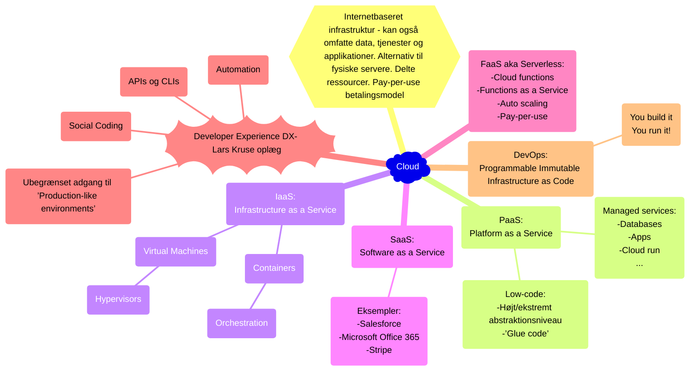

```mermaid
mindmap
 root )Cloud(
     definition {{Internetbaseret infrastruktur - kan også omfatte data, tjenester og applikationer. Alternativ til fysiske servere. Delte ressourcer. Pay-per-use betalingsmodel}}
     paas (PaaS:<br/>Platform as a Service)
       managed (Managed services:<br/>-Databases<br/>-Apps<br/>-Cloud run<br/>...)      
       lowcode (Low-code:<br/>-Højt/ekstremt abstraktionsniveau<br/>-’Glue code’)
     iaas (IaaS:<br/>Infrastructure as a Service)
       vm (Virtual Machines)
         hypervisor (Hypervisors)
       docker (Containers)
         orchestration (Orchestration)
     saas (SaaS:<br/>Software as a Service)
       ex (Eksempler:<br/>-Salesforce<br/>-Microsoft Office 365<br/>-Stripe)
     faas (FaaS aka Serverless:<br/>-Cloud functions<br/>-Functions as a Service<br/>-Auto scaling<br/>-Pay-per-use)
     dx))Developer Experience DX- Lars Kruse oplæg<br/>((
       api (APIs og CLIs)
       social (Social Coding)
       automation (Automation)
       ple (Ubegrænset adgang til ’Production-like environments’)
     devops (DevOps:<br/>Programmable Immutable Infrastructure as Code)
       proverb ("You build it<br/>You run it!")
```
