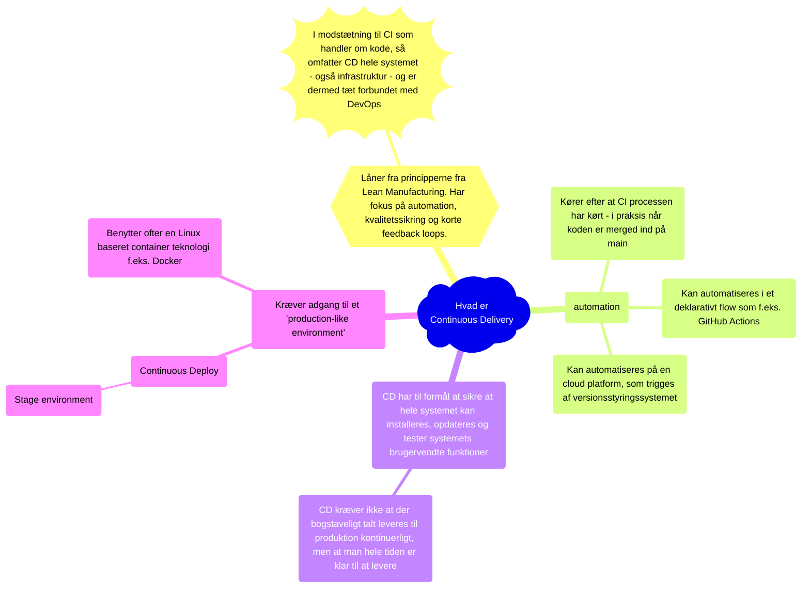

```mermaid
mindmap
 root)Hvad er <br/>Continuous Delivery(
   definition {{Låner fra principperne fra Lean Manufacturing. Har fokus på automation, kvalitetssikring og korte feedback loops.}}
     devops ))I modstætning til CI som handler om kode, så omfatter CD hele systemet - også infrastruktur - og er dermed tæt forbundet med DevOps((
   automation (automation)
     postcd (Kører efter at CI processen har kørt - i praksis når koden er merged ind på main)
     gha (Kan automatiseres i et deklarativt flow som f.eks. GitHub Actions)
     pull (Kan automatiseres på en cloud platform, som trigges af versionsstyringssystemet)
   purpose (CD har til formål at sikre at hele systemet kan installeres, opdateres og tester systemets brugervendte funktioner)
     ready (CD kræver ikke at der bogstaveligt talt leveres til produktion kontinuerligt, men at man hele tiden er klar til at levere)
   ple (Kræver adgang til et ’production-like environment’)
     deploy (Continuous Deploy)
       stage (Stage environment)
     docker (Benytter ofter en Linux baseret container teknologi f.eks. Docker)
```
