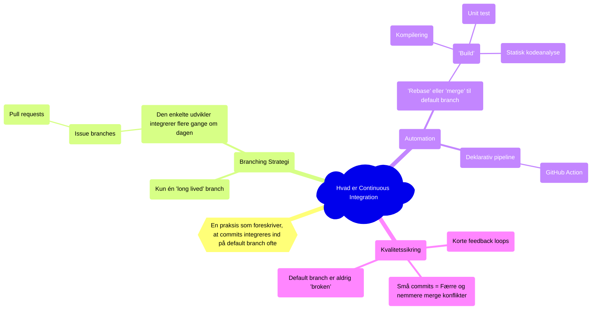

```mermaid
mindmap
  root )Hvad er Continuous Integration(
  ::: large
    definition {{En praksis som foreskriver, at commits integreres ind på default branch ofte}}
    branching (Branching Strategi)
      trunk (Kun én  ’long lived’ branch)
      integrate (Den enkelte udvikler integrerer flere gange om dagen)
        issues (Issue branches)
          pr (Pull requests)
    automation (Automation)
      rebase (’Rebase’ eller ’merge’ til default branch)
        build (’Build’)
          compile (Kompilering)
          test (Unit test)
          analysis (Statisk kodeanalyse)
      pipeline (Deklarativ pipeline)
        gha (GitHub Action)
    purpose (Kvalitetssikring)
      fedback (Korte feedback loops)
      commits (Små commits = Færre og nemmere merge konflikter)
      pristine (Default branch er aldrig ’broken’)
```
