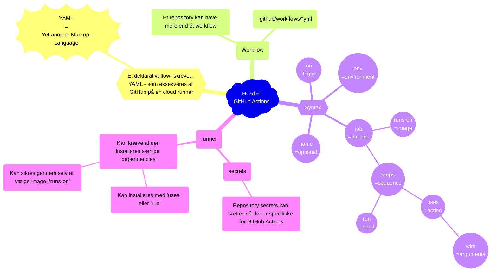

```mermaid
mindmap
 root)Hvad er <br/>GitHub Actions(
   definition {{Et deklarativt flow- skrevet i YAML - som eksekveres af GitHub på en cloud runner}}
     yaml ))YAML<br/>=<br/>Yet another Markup Language((
   workflow (Workflow)
     location (.github/workflows/*yml)
     multi (Et repository kan have mere end ét workflow)
   syntax {{Syntax}}
     name ((name<br/>=optional))
     on ((on<br/>=trigger))
     env ((env<br/>=environment))
     job ((job<br/>=threads))
       runson ((runs-on<br/>=image))
       steps ((steps<br/>=sequence))
         uses ((uses<br/>=action))
           with ((with<br/>=arguments))
         run ((run<br/>=shell))
   runner (runner)
     secrets (secrets)
       repo (Repository secrets kan sættes så der er specifikke for GitHub Actions)
     install (Kan kræve at der installeres særlige ’dependencies’)
       uses (Kan installeres med ’uses’ eller ’run’)
       docker (Kan sikres gennem selv at vælge image; ’runs-on’)
```
