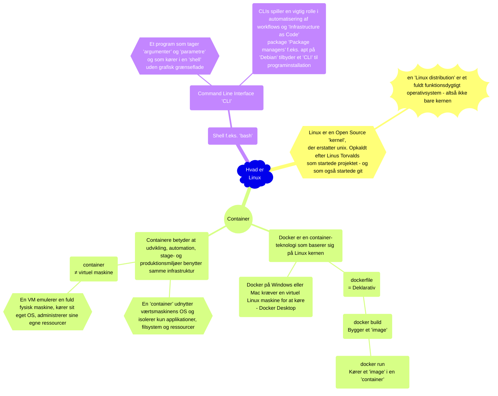

```mermaid
mindmap
 root)Hvad er <br/>Linux(
   definition {{Linux er en Open Source ’kernel’, 
                der erstatter unix. Opkaldt efter Linus Torvalds 
                som startede projektet - og som også startede git}}
     mf ))en ’Linux distribution’ er et fuldt funktionsdygtigt operativsystem - altså ikke bare kernen((
   container ((Container))
     docker (Docker er en container-teknologi som baserer sig på Linux kernen)
       dockerfile (dockerfile<br/>= Deklarativ)
         dockerbuild (docker build<br/> Bygger et ’image’)
           dockerrun (docker run<br/>Kører et ’image’ i en ’container’)
       vm (Docker på Windows eller Mac kræver en virtuel Linux maskine for at køre<br/>- Docker Desktop)
     immutable (Containere betyder at udvikling, automation, stage- og produktionsmiljøer benytter samme infrastruktur)      
       definition {{En ’container’ udnytter værtsmaskinens OS og isolerer kun applikationer, filsystem og ressourcer}}
       notvm (container<br/> ≠ virtuel maskine)
         definition {{En VM emulerer en fuld fysisk maskine, kører sit eget OS, administrerer sine egne ressourcer}}
   shell (Shell f.eks. ’bash’)      
     cli (Command Line Interface ’CLI’)
       definition {{Et program som tager ’argumenter’ og ’parametre’ og som kører i en ’shell’ uden grafisk grænseflade}}
       automation (CLIs spiller en vigtig rolle i automatisering af workflows og ’Infrastructure as Code’
       package ’Package managers’ f.eks. apt på ’Debian’ tilbyder et ’CLI’ til programinstallation)
```
