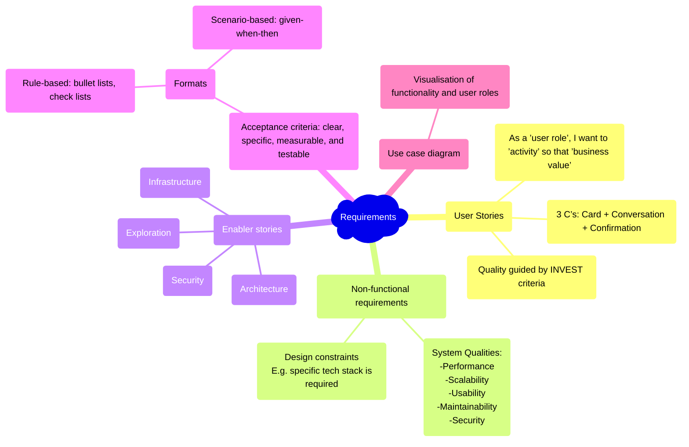

```mermaid
mindmap
 root )Requirements(    
     user stories (User Stories<br/>)
       format (As a ’user role’, I want to ’activity’ so that ’business value’)
       3c (3 C’s: Card + Conversation + Confirmation)  
       invest (Quality guided by INVEST criteria)       
     NFR (Non-functional requirements)
       system (System Qualities:<br/>-Performance<br/>-Scalability<br/>-Usability<br/>-Maintainability<br/>-Security)
       design (Design constraints<br> E.g. specific tech stack is required)
     enabler (Enabler stories)
         exploration (Exploration)
         architecture (Architecture)
         infrastructure (Infrastructure)
         security (Security)  
     acceptance (Acceptance criteria: clear, specific, measurable, and testable)
           format (Formats)
               rule (Rule-based: bullet lists, check lists)
               scenario (Scenario-based: given-when-then)
     use case diagram (Use case diagram)
         uml(Visualisation of functionality and user roles)         
```
