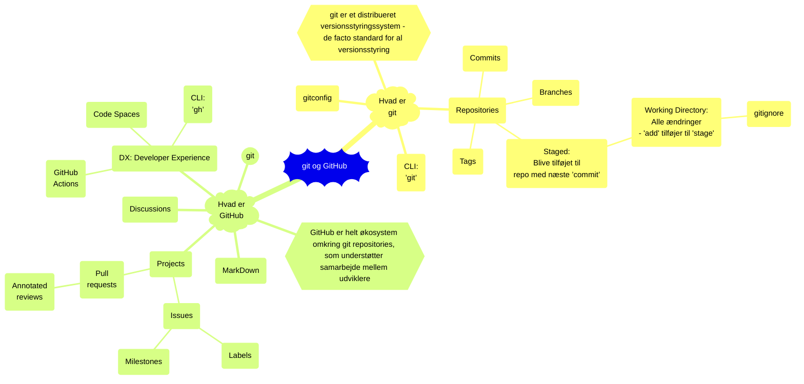

```mermaid
mindmap
 root ))git og GitHub((
   git )Hvad er <br/>git(
     definition {{git er et distribueret versionsstyringssystem - de facto standard for al versionsstyring}}
     repositories (Repositories)
       branches (Branches)
       tags (Tags)
       commmits (Commits)
       stage (Staged:<br/>Blive tilføjet til<br/>repo med næste ’commit’)
         workdir (Working Directory:<br/>Alle ændringer<br/>- 'add' tilføjer til 'stage')
           gitignore (gitignore)      
     cli (CLI:<br/>’git’)
     gitconfig (gitconfig)
   github )Hvad er <br/>GitHub(
     definition {{GitHub er helt økosystem omkring git repositories, som understøtter samarbejde mellem udviklere}}
     git ((git))
     markdown (MarkDown)
     discussions (Discussions)
     projects (Projects)
       issues (Issues)
         labels (Labels)
         milestones (Milestones)
       pr (Pull<br/>requests)
         review (Annotated<br/>reviews)
     dx (DX: Developer Experience)
       gha (GitHub<br/>Actions)
       codespaces (Code Spaces)
       cli (CLI:<br/>’gh’)
```
